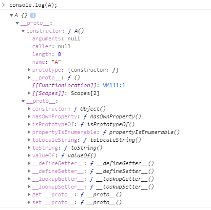
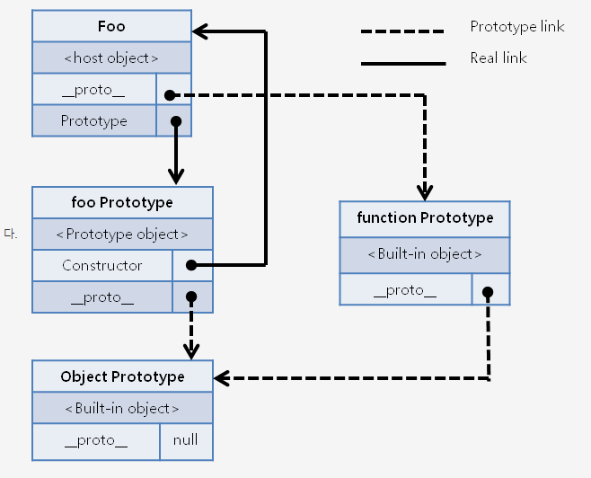
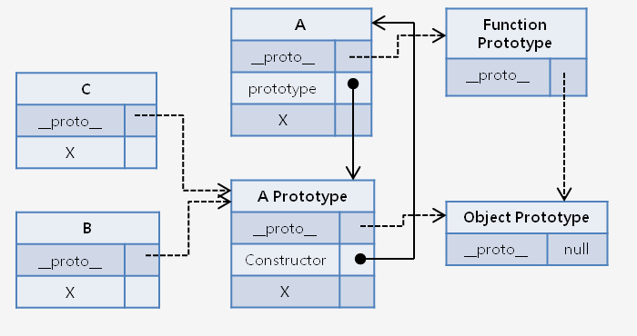
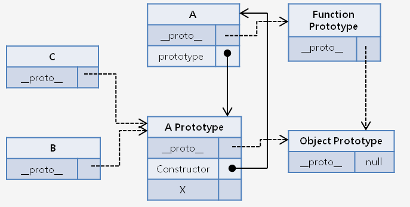

```

```

주제 : 자바스크립트 의 Prototype 이란?

참조 : http://insanehong.kr/post/javascript-prototype/

소개
Prototype inheritance , 확장과 재사용을 가능하게 해주는 문법.

자바스크립트는 Class 기반의 인스턴스를 생성하지 않는다.
Prototype 기반의 프로그래밍 언어이다.

객체지향적인 개발 개념을 가지기 위해서 자바스크립트는 prototype 이라는 개념을 사용한다.

<핵심개념>

1. Prototype Object
2. Prototype Link

이 프로토타입 기반 프로그래밍은 Class 기반 OOP 언어를 다루던 사람에게는 이해가 잘 안가는 부분 일수도 있다.
Class 기반의 언어에서는 Class 안에 기술된 내용을 기반으로 인스턴스를 생성하여 객체를 사용한다.
하지만 자바스크립트는 Class 가 존재하지 않는다.
그래서 자바스크립트에서는 객체의 원형인 프로토타입을 이용한 클로닝(Cloning: 복사)과 객체특성을 확장해 나가는 방식을 통해 새로운 객체를 생성해 낸다.
자바스크립트 응용에서 다룰 프로그래밍 패턴과 연관된 재밌는 사실중 하나는 자바스크립트의 프로토타입 객체의 확장은 옵져버패턴을 따른다.

```javascript
var foo = { name: "foo" }; // foo 라는 객체 생성
foo.prototype.a = "hello world";
console.log(foo.a);
```

== syntax error 발생

- 자바스크립트에서 사용되는 프로토타입이란 용어는 크게 두가지로 나눈다.
- Prototype Property 가 가리키고 있는 Prototype Object 와 자기 자신을 만들어낸 객체의 원형을 의미하는 Prototype Link 이다.
- 자바스크립트 관련 레퍼런스는 대부분 프로토타입에 대한 정의는 객체의 원형을 위미하는 Prototype Lick 로 정의하지만 Prototype property 가 자바스크립트에서 말하는 프로토타입이라고 이해하고 이를 사용한다.
- 하지만 이는 엄연히 틀린 의미이기 떄문에 제대로 이해하고 있어야한다.

자바스크립트의 프로토타입(Prototype) 이란?
자바스크립트의 모든 객체는 자신을 생성한 객체 원형에 대한 숨겨진 연결을 갖는다.
이떄 자기자신을 생성하기 위해 사용된 객체 원형을 프로토타입이란 한다.
자바스크립트의 모든 객체는 Object 객체의 프로토타입을 기반으로 확장 되었기 떄문에 이 연결의 끝은 Object 객체의 프로토타입 Object다.

자명한 사실이다. 프로토타입이란 의미 자체가 원형 , 원본이란 말이지 않은가? 자바스크립트에서 말하는 프로토 타입 역시 문법적인 의미에서 벗어나지 안흔다. 즉, 어떠한 객체가 만들어지기 위해 그 객체의 모태가 되는 녀석을 프로토타입이라고 한다. Java , php 에서 말하는 Class 가 바로 자바스크립트의 프로토 타입과 동일한 의미일것 이다.

```javascript
function A() {}
var A = new A();
console.log(A);
```

위 예제는 new Operator를 사용하여 A라는 객체 생성자를 이용한 새로운 객체를 생성하여 B 라는 변수에 담는 코드이다.
그렇게 만들어진 객체를 console.log를 찍어보면 아래와 같은 내용을 확인할 수 있다.



위 내용에서 주의깊게 봐야할 것이 있다. 바로 **proto**와 constructor 이다. **proto** 바로 이 녀석이 A 라는 객체를 만들어 내기 위해 사용된 객체원형에 대한 숨겨진 연결이다. 해당객체의 프로토 타입은 A 라는 함수객체이며 이 객체의 생성자 역시 function A() 함수 라는 것이다. 즉 new Operator를 통해 만들어진 객체는 function A() 를 자신의 프로토 타입으로 사용하여 만들어졌다는 말이다.

<h1>자바스크립트의 프로토타입(prototype) 프로퍼티 란?</H1>
모든 함수 객체의 Constructor prototype 이란 프로퍼티를 가지고 있다. 이 prototype 프로퍼티는 객체가 생성될 당시 만들어지는 객체 자신의 원형이 될 prototype 객체를 가리킨다. 즉 자신을 만들 원형이 아닌 자신을 통해 만들어질 객체들이 원형으로 사용할 객체를 말한다.

```javascript
function foo() {}
var foo = new foo();
```



위 관계도에서 알 수 있든 모든 객체의 확장은 객체가 소유한 Prototype Object를 통해 이루어지며 이 연결의 끝은 이전 글에서 소개한 Object 객체의 prototype Object 가 된다. 일반적으로 자바스크립트 코드를 통해 다루는 Prototype 이 객체가 소유한 자기자신의 prototype Object 이기 때문에 대부분의 자바스크립트 입문자는 프로토타입이란 것을 Prototype property 라고 생각하게 되는 오류를 범하게 되는 것이다.

```javascript
//#예제 1.
var A = function () {
    this.x = function () {
         console.log('hello');
    };
};
A.x=function() {
    console.log('world');
};
var B = new A();
var C = new A();
B.x();
> hello
C.x();
> hello

//#예제 2.
var A = function () { };
A.x=function() {
    console.log('hello');
};
A.prototype.x = function () {
     console.log('world');
};
var B = new A();
var C = new A();
B.x();
> world
C.x();
> world
```

예제1, 예제2 에서 B,C 를 생성하기 위한 객체 원형 프로토타입은 A 이다. 하지만 여기서 반드시 집고 넘어가야하는 사실은 B,C는 A 를 프로토타입으로 사용하기위해서 A의 prototype Object를 사용한다는 것이다. 그리고 이 Prototype Object는 A 가 생성될 당시의 정보만을 가지기 때문에 예제1에서 A의 Prototype Object가 알고 있는 x 는 function () {console.log('hello');} 가 된다. 즉 A.x 를 아무리 수정하여도 A의 Prototype Object는 변경되지 않기 때문에 A 를 프로토타입으로 생성되는 B,C는 function () {console.log('hello');} 만 참조하는 것이다.

예제2 에서의 결과가 world 가 되는 이유도 같은 이유다. A.prototype 은 A의 Prototype Object를 참조하는 녀석이기 때문에 A.prototype.x 를 정의한다는 것은 A의 Prototype Object를 직접 이용하게 되는 것이고 그에 따라서 A의 Prototype Object를 프로토타입으로 이용하여 만들어지는 B,C 가 알고 있는 x 는 function () {console.log('world');} 가 되는 것이다.





- 상속 과 공유의 차이
- 상속 : 객체 스스로가 선언될떄부터 가지고 있을 경우, 하위 객체들은 그 값을 가지고 있다.

fucntion A(){
this.x = "hello";
}

var test = new A();
test.x => hello

- 공유 : 사용된 메서드를 가지고 있지 않을경우, 상위 객체까지 찾아가서 호출을 한다. 만약, 해당 메소드가 발견이 안된다면 undefined 가 된다.
- 그래서 공유된 메서드는 , 해당 내용을 가지고 있지 않아도, 하위 객체에서 값을 공유 한다.

리모트 테스트
