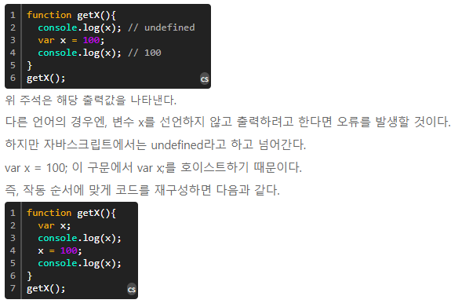
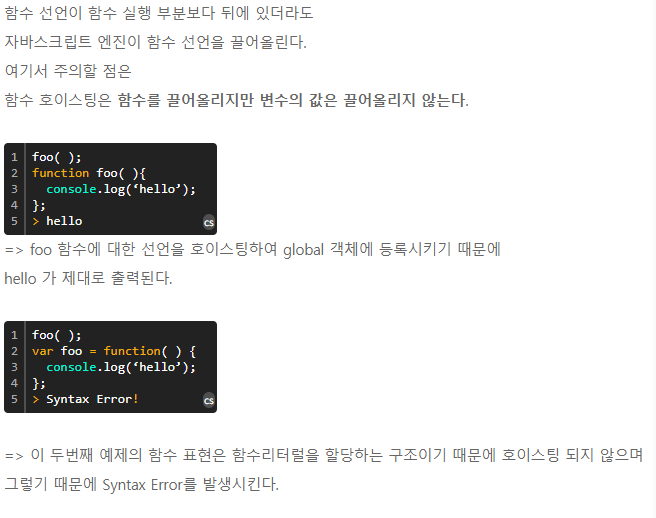

자바스크립트 문법

호이스팅

1. Hoist 란
사전적 정의는 끌어올리기 다.

 * 자바스크립트에서 끌어올려지는 것은 변수이다.

모든 변수의 선언은 호이스트 된다.

호이스트란 변수의 정의가 그 범위에 따라 선언관 할당으로 분리되는 것을 의미한다.
즉, 변수가 함수 내에서 정의되었을 경우, 선언이 함수의 최상위로, 함수 바깥에서 정의되었을 경우, 전역 컨텍스트의 최상위로 변경된다.

2. 선언과 할당의 차이를 인식하자.
끌어올려지는 것은 선언이다.

선언문은 항시 자바스크립트 엔진 구동시 가장 최우선으로 해석하고 할당 구문은 런타임 과정에서 이루어지기 때문에, 호이스팅 되지 않는다.

출처 :  http://asfirstalways.tistory.com/197
