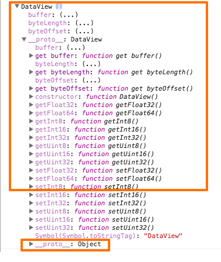
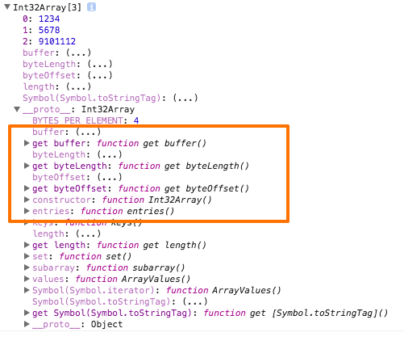
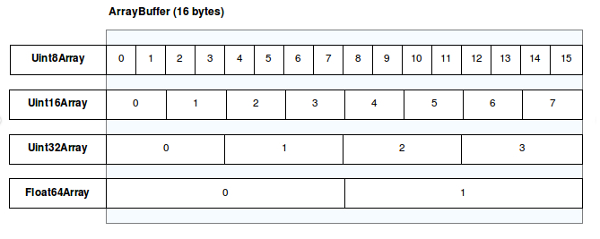

~~~
~~~

주제 : JavaScript Typed Array

정의
1. Typed Array는 raw binary data 에 접근하기 위한 방법을 제공한다.
    - 즉 자바스크립트로 binary data 를 다루기 위해 사용한다.

2. 유연성과 효율성을 위해 buffer 와 view 로 나눠 구현되어있다.
    - buffer
      - ArrayBuffer 는 고정된 크기의 raw binary data를 나타내기 위해 사용된다.
      - ArrayBuffer 클래스 통해 생성된 buffer는 데이터 청크를 나타내는 객체이다.
        ~~~
        // 12 bytes buffer 나타낸다.
        var buffer = new ArrayBuffer(12);
        ~~~
      - buffer는 저장된 데이터를 접근하기 위한 방법을 제공하지 않는다.
      - 데이터를 다루기 위해서는 반드시 view 를 사용해야한다.
   - View
     - DataView
        DataView View는 buffer에 저장된 데이터로 부터 값을 읽고, 쓰기 위한 low-level 인터페이스를 제공한다. ( getter/ setter API 제공)

        ~~~
        //12 bytes buffer
        var buffer = new ArrayBuffer(12);

        //view를 생성한다.
        var view = new DataView(buffer, 2, 2);

        // 해당 view 가 시작하는 위치를 반환한다.
        console.log(view.byteOffset); // 2
        ~~~
    
    데이터를 다루기위한 DataView 의 특성들은 아래와 같다.

    

    -Typed Array Views
    DataView 를 상속한 아래 클래스들을 통해 buffer 에 저장된 데이터를 다룰 수 있게된다.
    
    Int8Array, Uint8Array, Int32Array, Uint32Array 등 …
    
    위 클래스 중 Int32Array 를 통해 생성된 view 는 아래와 같은 특성들을 가지게된다.

     

     아래 그림은 각 view 에 따라 나눠지는 메모리 공간을 나타낸다.

     

     ~~~
      /*

        ArrayBuffer(20 bytes)ㄴ
        8bit == 1 byte

        ArrayBuffer / 1 byte = 20;

        */
        var buffer = new ArrayBuffer(20);
        // 부호 없는 1 byte 정수 배열
        var uint8View = new Uint8Array(buffer);

        console.log(uint8View.length); // 20

        /*

        ArrayBuffer(20 bytes)
        32bit == 4 byte

        ArrayBuffer / 4 byte = 5;

        */

        var buffer = new ArrayBuffer(20);
        // 부호 없는 4 byte 정수 배열
        var uint32View = new Uint32Array(buffer);

        console.log(uint32View.length); // 5
     ~~~

     unsigned or signed view test

     ~~~
        // unsigned int 8(1 bytes)

        var buffer = new ArrayBuffer(20);
        var uint8View = new Uint8Array(buffer);

        // 0 ~ 255(unsigned int 8(1 bytes) 로 표현 가능한 수)
        uint8View[0] = 0;
        uint8View[1] = 255;

        console.log(uint8View); 
        // [0, 255, 0, 0, 0, 0, 0, 0, 0, 0, 0, 0, 0, 0, 0, 0, 0, 0, 0, 0]

        // signed int 8(1 bytes)

        var buffer = new ArrayBuffer(20);
        var int8View = new Int8Array(buffer);

        // -127 ~ 128(signed int 8(1 bytes) 로 표현 가능한 수)

        // signed 의 경우 부호(양수/음수)를 나타내기 위해 총 8bit 중 1 비트(0: 양수, 1: 음수) 사용하기 때문에, 나머지 7bit(-127 ~ 128(표현 가능한 수))를 통해 숫자를 표현하게 된다.

        int8View[0] = -128;
        int8View[1] = 127;

        console.log(int8View); 
        
        // [-128, 127, 0, 0, 0, 0, 0, 0, 0, 0, 0, 0, 0, 0, 0, 0, 0, 0, 0, 0]

        // unsigned int 16(2 bytes)
        var buffer = new ArrayBuffer(20);
        var uint16View = new Uint16Array(buffer);

        // 0 ~ 65535(unsigned int 16(2 bytes) 로 표현 가능한 수)
        uint16View[0] = 65535;

        console.log(uint16View); // [65535, 0, 0, 0, 0, 0, 0, 0, 0, 0]
     ~~~