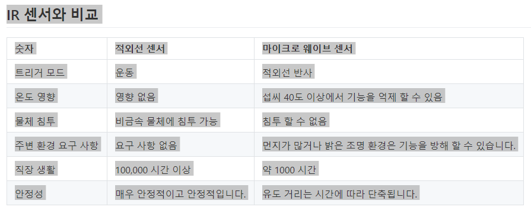

```

```

주제 : 하드웨어 프로퍼티 정보

Hardward Module Props

보드

1. 라즈베리파이 3B+

-BCM2837B0-
이것은 Raspberry Pi 3B + 및 3A +에서 사용되는 Broadcom 칩입니다. BCM2837B0의 기본 아키텍처는 Pi의 다른 버전에서 사용되는 BCM2837A0 칩과 동일합니다. ARM 코어 하드웨어는 동일하며 주파수 만 높게 평가됩니다.

ARM 코어는 최고 1.4GHz로 동작 할 수있어 원래의 Raspberry Pi 3보다 3B + / 3A +가 약 17 % 빠릅니다. VideoCore IV는 400MHz에서 실행됩니다. ARM 코어는 64 비트이고 VideoCore IV는 32 비트입니다.

BCM2837B0 칩은 BCM2837A0과 약간 다르게 포장되어 있으며 특히 열 발산을 위해 히트 스프레더가 포함되어 있습니다. 이를 통해 더 높은 클록 주파수 (또는 전력 소비를 줄이기 위해 더 낮은 전압에서 실행)를 허용하고 칩 온도의보다 정확한 모니터링 및 제어가 가능합니다.

Raspberry Pi 블로그의이 게시물 은 BCM2837B0 칩에 대해 자세히 설명합니다.

이전의 Raspberry Pi 칩에 대한 정보는 다음 문서를 참조하십시오.

센서

1. PMS 7003 (미세먼지 센서)
2. DHT 22 (온습도 센서)

---

PMS 7003 Specifications

- Zero false alarm rate
- Real-time response
- Correct data
- Minimum distinguishable particle diameter :0.3 micrometer
- High anti-interference performance because of the patent structure of six
- sides shielding
- Optional direction of air inlet and outlet in order to adapt the different
- design
- Very Slim

사용 소켓

1. VNC : 5v , 1 개
2. GND : 1 개
3. TXD0 : 1 개
4. RXD0 : 1 개

---

DHT22 Specifications

- Operating Voltage: 3.5V to 5.5V
- Operating current: 0.3mA (measuring) 60uA (standby)
- Output: Serial data
- Temperature Range: -40°C to 80°C
- Humidity Range: 0% to 100%
- Resolution: Temperature and Humidity both are 16-bit
- Accuracy: ±0.5°C and ±1%

사용 소켓

1. VNC : 3.3V 1 개
2. GND : 1개
3. GPIO : 4번 (PIN값 교체 가능)

통신방법 : BCM GPIO

---

MicroWave_Sensor_SKU\_\_SEN0192

참고 ; https://www.youtube.com/watch?v=ieVnaPnPzT0

전자파 탐지 방법은 다른 탐지 방법에 비해 다음과 같은 장점이 있습니다.

물리적 접촉없이 물체를 감지 할 수 있음
온도, 습도, 소음, 공기, 먼지 또는 빛의 영향을받지 않는 판독 값 -
무선 주파수 간섭에 강한 저항
낮은 출력, 인체에 해롭지 않음
마이크로파는 빛의 속도와 동일한 넓은 탐지 범위와 속도를 가지고 있습니다.
비 평범한 물체 감지 지원

탐지 각도 : 탐지 각도는 안테나가 평행 한 방향 (방위각)에서 72도입니다. 안테나의 수직 (피치) 방향은 36도입니다.

- 스펙
  ```
      작동 전압 : 5V +/- 0.25V
      동작 전류 (CW) : 최대 60mA, 일반 37mA
      크기 : 48.5x63mm
      배출량 :
      감지 거리 : 2 ~ 16M 연속 조절 가능
      방사 주파수 : 10.525 GHz
      정밀 주파수 설정 : 3MHz
      출력 전력 (최소) : 13dBm EIRP
      고조파 방출 : <-10dBm
      평균 전류 (5) : 2mA typ.
      펄스 폭 (최소) : 5uSec
      로드 사이클 (최소) : 1 %
      리셉션 :
      감도 (10dB S / N 비) 3Hz ~ 80Hz 대역폭 : -86dBm
      3Hz ~ 80Hz 대역폭 혼탁 : 10uV
      안테나 이득 : 8dBi
      세로 3dB 빔 폭 : 36도
      레벨 3dB 빔 폭 : 72도
  ```


