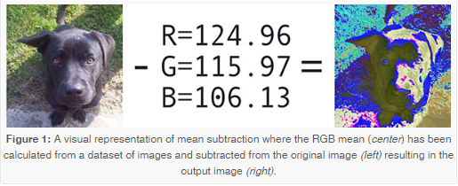

```

```

---

## #파이썬 라즈베리파이

실행 명령어 : python mobilenet_ssd_python.py --video http://121.160.17.78:8000/stream.mjpg

mobilenet_ssd_python.py

```python

#Import the neccesary libraries
import numpy as np
import argparse
import cv2


# construct the argument parse
parser = argparse.ArgumentParser(
    description='Script to run MobileNet-SSD object detection network ')
parser.add_argument("--video", help="path to video file. If empty, camera's stream will be used")
parser.add_argument("--prototxt", default="MobileNetSSD_deploy.prototxt",
                                  help='Path to text network file: '
                                       'MobileNetSSD_deploy.prototxt for Caffe model or '
                                       )
parser.add_argument("--weights", default="MobileNetSSD_deploy.caffemodel",
                                 help='Path to weights: '
                                      'MobileNetSSD_deploy.caffemodel for Caffe model or '
                                      )
parser.add_argument("--thr", default=0.2, type=float, help="confidence threshold to filter out weak detections")
args = parser.parse_args()

# Labels of Network.
classNames = { 0: 'background',
    1: 'aeroplane', 2: 'bicycle', 3: 'bird', 4: 'boat',
    5: 'bottle', 6: 'bus', 7: 'car', 8: 'cat', 9: 'chair',
    10: 'cow', 11: 'diningtable', 12: 'dog', 13: 'horse',
    14: 'motorbike', 15: 'person', 16: 'pottedplant',
    17: 'sheep', 18: 'sofa', 19: 'train', 20: 'tvmonitor' }

# Open video file or capture device.
if args.video:
    cap = cv2.VideoCapture(args.video)
else:
    cap = cv2.VideoCapture(0)

#Load the Caffe model
net = cv2.dnn.readNetFromCaffe(args.prototxt, args.weights)

while True:
    # Capture frame-by-frame
    ret, frame = cap.read()
    frame_resized = cv2.resize(frame,(300,300)) # resize frame for prediction

    # MobileNet requires fixed dimensions for input image(s)
    # so we have to ensure that it is resized to 300x300 pixels.
    # set a scale factor to image because network the objects has differents size.
    # We perform a mean subtraction (127.5, 127.5, 127.5) to normalize the input;
    # after executing this command our "blob" now has the shape:
    # (1, 3, 300, 300)
    blob = cv2.dnn.blobFromImage(frame_resized, 0.007843, (300, 300), (127.5, 127.5, 127.5), False)
    #Set to network the input blob    net.setInput(blob)
    #Prediction of network
    detections = net.forward()

    #Size of frame resize (300x300)
    #.shape[] = return dimension
    cols = frame_resized.shape[1]
    rows = frame_resized.shape[0]

    #For get the class and location of object detected,
    # There is a fix index for class, location and confidence
    # value in @detections array .
    for i in range(detections.shape[2]):
        confidence = detections[0, 0, i, 2] #Confidence of prediction
        if confidence > args.thr: # Filter prediction
            class_id = int(detections[0, 0, i, 1]) # Class label

            # Object location
            xLeftBottom = int(detections[0, 0, i, 3] * cols)
            yLeftBottom = int(detections[0, 0, i, 4] * rows)
            xRightTop   = int(detections[0, 0, i, 5] * cols)
            yRightTop   = int(detections[0, 0, i, 6] * rows)

            # Factor for scale to original size of frame
            heightFactor = frame.shape[0]/300.0
            widthFactor = frame.shape[1]/300.0
            # Scale object detection to frame
            xLeftBottom = int(widthFactor * xLeftBottom)
            yLeftBottom = int(heightFactor * yLeftBottom)
            xRightTop   = int(widthFactor * xRightTop)
            yRightTop   = int(heightFactor * yRightTop)
            # Draw location of object
            cv2.rectangle(frame, (xLeftBottom, yLeftBottom), (xRightTop, yRightTop),
                          (0, 255, 0))

            # Draw label and confidence of prediction in frame resized
            if class_id in classNames:
                label = classNames[class_id] + ": " + str(confidence)
                labelSize, baseLine = cv2.getTextSize(label, cv2.FONT_HERSHEY_SIMPLEX, 0.5, 1)

                yLeftBottom = max(yLeftBottom, labelSize[1])
                cv2.rectangle(frame, (xLeftBottom, yLeftBottom - labelSize[1]),
                                     (xLeftBottom + labelSize[0], yLeftBottom + baseLine),
                                     (255, 255, 255), cv2.FILLED)
                cv2.putText(frame, label, (xLeftBottom, yLeftBottom),
                            cv2.FONT_HERSHEY_SIMPLEX, 0.5, (0, 0, 0))

                print(label) #print class and confidence

    cv2.namedWindow("frame", cv2.WINDOW_NORMAL)
    cv2.imshow("frame", frame)
    if cv2.waitKey(1) >= 0:  # Break with ESC
        break

```

---

질문 1 : net = cv2.dnn.readNetFromCaffe(args.prototxt, args.weights)

Caffe 프레임 워크 형식으로 저장된 네트워크 모델을 읽습니다 .

prototxt path to the .prototxt file with text description of the network architecture.
caffeModel path to the .caffemodel file with learned network.

---

질문 2 : blob??? 이 뭐야?

참고 : https://www.pyimagesearch.com/2017/11/06/deep-learning-opencvs-blobfromimage-works/

blob = cv2.dnn.blobFromImage(frame_resized, 0.007843, (300, 300), (127.5, 127.5, 127.5), False)

심층 학습 및 이미지 분류와 관련하여 이러한 사전 처리 작업에는 일반적으로 다음이 포함됩니다.

1. 평균 빼기
2. 어떤 요인에 의한 스케일링

OpenCV의 새로운 심층 신경망 ( dnn ) 모듈에는 사전 처리 된 심층 학습 모델을 통해 이미지를 사전 처리하고 분류하기 위해 사용할 수있는 두 가지 기능이 포함되어 있습니다.

1. 평균 빼기
2. 스케일링
3. 선택적으로 채널 스와핑

 {:.aligncenter}

OpenCV의 깊은 학습 전처리 함수에 대해 설명하기 전에 먼저 평균 빼기를 이해해야합니다. 평균 빼기는 데이터 세트의 입력 이미지에서 조명 변화를 방지하는 데 사용됩니다. 그러므로 우리는 Convolutional Neural Networks를 돕는 기법으로 평균 빼기를 볼 수 있습니다.

우리는 심 신경 네트워크를 훈련하기 전에, 먼저 Red, Green 및 Blue 채널 각각에 대해 교육 세트의 모든 이미지에 대한 평균 픽셀 강도 를 계산합니다 .

이것은 우리가 세 변수로 끝난다는 것을 의미합니다 :

\ mu_R, \mu_G \ mu_B

일반적으로 결과 값은 각각 빨강, 녹색 및 파랑 채널의 평균으로 구성된 3- 튜플입니다.

예를 들어, ImageNet 교육 세트의 평균값은 R = 103.93 , G = 116.77 및 B = 123.68 입니다. ImageNet에서 사전 교육을받은 네트워크를 사용하기 전에 이러한 값을 이미 경험했을 수 있습니다.

그러나 경우에 따라 빨강, 녹색 및 파랑의 평균값 이 픽셀 단위가 아닌 채널 단위 로 계산 될 수 있으므로 MxN 행렬이 생성됩니다 . 이 경우에, 각 채널에 대한 M × N 행렬은 훈련 / 테스트 동안 입력 이미지로부터 감산된다.

두 방법 모두 평균 빼기의 완벽한 형태입니다. 그러나 우리는 특히 더 큰 데이터 세트의 경우 픽셀 위주 버전이 더 자주 사용되는 경향이 있습니다 .

우리가 우리의 네트워크를 통해 이미지를 통과 할 준비가되면 (여부에 대한 교육 또는 시험 ), 우리는 빼기 평균을 , \ mu입력 영상의 각 입력 채널에서 :

R = R - \ mu_R
G = G - \ mu_G
B = B - \ mu_B
우리는 또한있을 수 있습니다 스케일링 팩터 , \ 시그마정상화에 추가 :

R = (R - \ mu_R) / \ sigma

G = (G - \ mu_G) / \ sigma

B = (B - \ mu_B) / \ sigma

의 값은 \ 시그마훈련 세트의 표준 편차 일 수 있습니다 (따라서 전처리 단계를 표준 점수 / z 점수로 전환 할 수 있습니다). 그러나 \ 시그마수동으로 설정 (대수 계산)하여 입력 이미지 공간을 특정 범위로 확장 할 수도 있습니다. 이는 실제로 아키텍처, 네트워크 교육 방법 및 구현 작성자가 익숙한 기술에 따라 다릅니다.

모든 심층 학습 아키텍처가 평균 빼기 및 스케일링을 수행 하는 것은 아닙니다. 이미지를 사전 처리하기 전에 사용중인 심층 신경 네트워크에 대한 관련 발행물 / 설명서를 읽으십시오.

깊은 학습 여정에서 찾을 수 있듯이 일부 아키텍처는 평균 빼기 만 수행하므로 설정 \ sigma = 1됩니다. 다른 아키텍처는 평균 빼기와 스케일링을 모두 수행합니다. 다른 아키텍처에서도 평균 빼기 나 스케일링 을 수행 하지 않습니다 . 작성자가 사용중인 기술을 확인하기 위해 구현 / 사용중인 관련 발행물을 항상 확인하십시오.

평균 빼기, 스케일링 및 정규화에 대한 자세한 내용 은 컴퓨터 비전을위한 Python으로 학습하십시오 .

비공식적으로 블롭 은 동일한 공간 차원 (즉, 너비와 높이), 동일한 깊이 (채널 수)를 가지며 동일한 방식으로 모두 사전 처리 된 이미지 (잠재적 컬렉션) 일뿐입니다.
