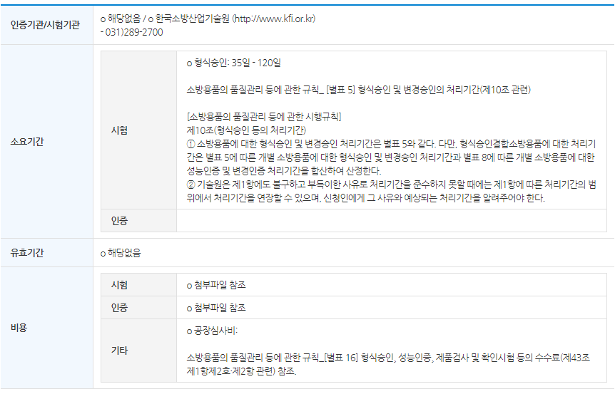

1. IoT 보안 인증 서비스 스타트! 인증·암호 등 5개 영역 평가

https://www.boannews.com/media/view.asp?idx=65784

민간 자율인터넷 시험인증기관 KISA
![IoT 보안 시험 인증기준[자료=과기정통부]](./20171228iot2.jpg)

2. http://www.intertek.co.kr/wp-content/uploads/2018/02/KC_guideline_kr_201802.pdf
   KC 인증 가이드라인

3)KC 인증
https://standard.go.kr/KSCI/crtfcPotIntro/crtfcSystemIntro.do?menuId=540&topMenuId=536&upperMenuId=539

국가통합인증마크(KC)의 필요성
현재 우리나라에는 총 70여개의 법정의무인증제도가 있습니다. ‘제품 안전’이라는 똑같은 목적이더라도, 부처마다 인증마크가 달라 중복해서 인증받아야하는 불편함이 있었습니다. 그러다 보니 시간과 비용이 낭비되는 것은 물론이고, 국가간 거래에 있어 상호 인증이 되지 않아 재 인증을 받아야 하는 등 국제 신뢰도 저하와 국부 유출의 문제를 가져왔습니다. 이에 13개 법정의무인증마크를 국가통합인증마크 하나로 통합하였습니다.(‘11.1)

인증(Certification) : 제품 등과 같은 평가대상이 정해진 표준이나 기술규정 등에 적합 하다는 평가를 받음으로써 그 사용 및 출하가 가능하다는 것을 입증하는 행위를 말한다.

인증제도의 정의
인증제도란 평가대상이 그에 적용되는 평가기준에 만족하는지 여부를 판단하기 위해 자격을 갖춘 자가 평가를 직접 수행하거나 제3자의 평가결과를 근거로 입증하는 행위를 말한다. ( ISO/IEC 17000, KS A ISO/IEC Guide 2 )

인증제도의 구분
인증제도는 법적 근거의 유무에 따라 법정인증제도와 민간인증제도로 구분되며 법정인증제도는 또다시 강제성의 유무에 따라 강제인증과 임의인증으로 나뉘어진다. 또한, 각 부 처에서 시행하고 있는 인증제도는 인증, 형식승인, 검정, 형식검정, 형식등록 등 인증대상의 특성에 따라 다양한 명칭으로 운영되고 있다.

인증제도의 운영
대부분의 인증 절차는 국가기관 등과 같은 공신력 있는 기관으로부터 인정을 받은 시험소에서 수행하도록 하고 있으며 인증과 표준, 검사, 시험, 시험소 인정 등은 서로 밀접하게 관련된다.

시험(Testing)
제품, 공정 또는 서비스에 대하여 규정된 요구사항에 따라 특성을 확인하는 것
※ “시험”은 일반적으로 자재, 제품 또는 프로세스에 적용

검사(Inspection)
제제품설계, 제품, 공정(프로세스) 또는 설치에 대하여 조사를 실시하고 규정된 요구사항에 대한 적합성 여부를 확인하는 것
※ 공정(프로세스) 검사에는 사람, 시설, 기술 및 방법에 대한 검사가 포함될 수 있음

인증(Certification)
제품, 시스템, 자격, 서비스 등에 대하여 규정된 요구사항이 충족되었다는 것을 보증하는 것으로 인증대상에 따라 제품인증,?서비스인증, 시스템인증, 자격(인력)인증 등으로 구분되며 인증, 형식승인, 검정, 지정, 허가 등 다양한 용어로 사용

기관별로 인증이 있따.
소방청은

- 탱크안전성능검사 위험물안전관리법 법정의무 안전 소방청 1996-07-01
- 소방용품형식승인 소방시설 설치ㆍ유지 및 안전관리에 관... 법정의무 안전 소방청 1974-09-01
  --소방용품 중 대통령령으로 정하는 32개 품목을 대상으로 제품을 생산전에 견품을 제출하여 개발제품에 대한 안전성을 형식시험하여 형식승인서를 부여하고 형식승인된 제품은 유통 전 매 생산시 검사를 실시하고 합격된 제품에는 --합격표지 부착하는 제도.

  

-소방용품우수품질인증 소방시설 설치ㆍ유지 및 안전관리에 관... 법정임의 품질 소방청 2003-05-23

-소방용기계,기구 성능인증 소방시설 설치ㆍ유지 및 안전관리에 관... 법정임의 품질 소방청 1981-04-01

-방염성능검사 소방시설 설치ㆍ유지 및 안전관리에 관... 법정의무 안전 소방청 1993-01-01

적합등록

적합인증 대상이 아닌 방송통신기자재등을 제조 또는 판매하거나 수입하려는 경우 적합성평가기준에 관한 시험을 거쳐 등록하는 적합성평가입니다.

http://mmc9001.com/sub/certification/cer0404.asp?gclid=CjwKCAiA58fvBRAzEiwAQW-hzVKQP_VGIFY1ZpeNJ0iRxq5RH8aSm0JRfCHaV1HD1X0z3ltBhJLaJhoC_6QQAvD_BwE

소방용품 인증