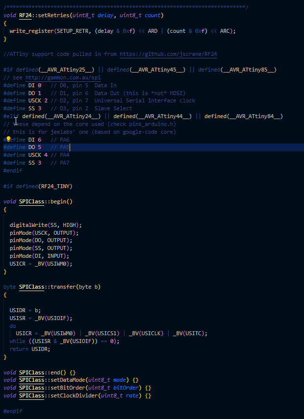

Attiny84 nrf 잘 안됬던 이유

SPI 핀 매핑이 잘못 선언되었다.

해결하자.

http://highlowtech.org/?p=1695

ATtiny84 를 부트로드 하는 과정에 사용되는 library 가 뭐인가에 따라서
핀 맵핑이 결정된다.

---

핀 체인지 인터럽트

1. 화재감지기의 신호에 인터럽트가 반응이 되질 않는다.
2. 아날로그 인풋을 인터럽트로 잡는다. ( 슬립모드:파워다운 에서는 ADC로 웨이크업이 일어나지 않는다. 핀체인지 인터럽트나 외부 인터럽트여야한다.)
3. 기준 전압이 뭘까? 핀의 전압 레벨의 변화를 잡아내는 것일까?
4. 내가 해야하는 일은 화재감지기의 불규칙한 전압을 잡아내는 건데...

너무 다양한 분야의 직업군의 팀원분들이라서 공통적인 관심사를 완벽하게 맞출순 없겠지만,
일이라는 점에서 공통적인 목표는 비즈니스와 관련된 주제를 가되,
미션 레벨은 저수준에서 단계적 성취로 가는게 어제 강연해주신 방향이 되지 않을까 싶습니다.
기름붓기에서 사용하는 작심2주 같은 개인레벨의 성취도 평가도 나쁘지 않을것 같다고 생각해요.